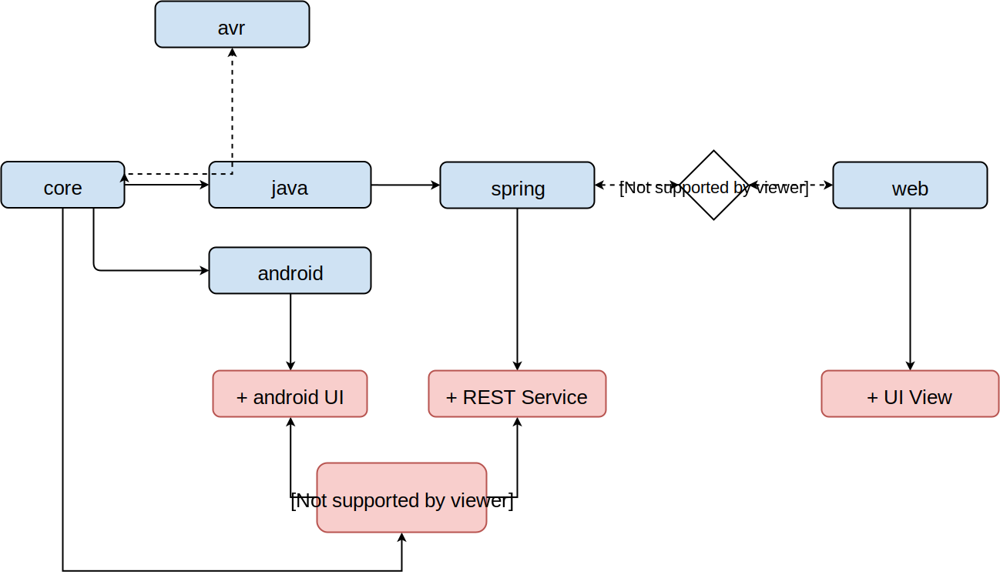

# blackbird

what the project does

## Usage

why the project is useful

    TVRemote remote = new TVRemote(); // old unused infrared remote
    RemoteSocket socket = new RemoteSocket("1000001100"); // remote socket with cryptic ID

    TVRemote.map(remote, ON_OFF_KEY, () -> Socket.toggle(socket));

## Getting Started

how the user can get started

## Structure

blackbird is separated into many packets to be fully scalable on each platform and device.

### core
The core package contains all platform independent Java implementation.
This code must compile and run on every Java supporting (essentially this means JVM and android).
core is definitely the largest packet, everything that can run on both (JVM and android) should be implemented in this package.

The java and android package sit on top of the core proving only hardware/OS dependent implementation for the specific device.

### java
Primarily this package provides RXTX communication.

### android
TODO, added later, still in work
This package shall provides an android front-end of blackbird.

### spring
TODO, added later, still in work

This packages uses Spring to wrap backbird in an REST interface later consumed by the web package for a responsive desktop application.

### web / electron
TODO, added later, still in work

To build a responsive desktop application this package uses web technologies (HTML, CSS, JS, Angular, Bootstrap).
Later this shall be wrapped in electron (http://electron.atom.io/).

### avr
The avr packet contains the C++ AVR implementation of a communication protocol
allowing the main application (the core package) to controll low-level devices (similar to Firmata https://github.com/firmata/arduino).

### more packets
There is no downside to new packets.
For example an ARM/raspberry packet offering GPIO functions.
